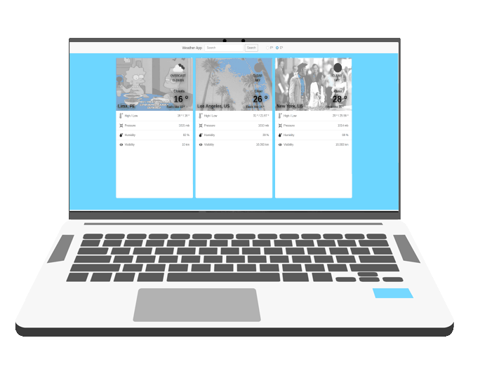

<p align="center">
    
</p>

<p align="center">
    <h1 align="center"> Weather App  </h1>    
</p>

<p align="center">
    <h2 align="center"> Web application to show the current weather forecast.</h2>    
</p>

<p align="center">
    <a href="https://img.shields.io/badge/Microverse-blueviolet" alt="Contributors">
        </a>
    <a href="https://www.w3schools.com/js/js_es6.asp" alt="JavaScript">
        </a>
    <a href="https://webpack.js.org/" alt="Webpack">
        </a>      
    <a href="https://getbootstrap.com/" alt="Bootstrap">
        </a>
    <a href="https://sass-lang.com/" alt="SASS">
        </a>
        
</p>


  <p align="center">    
    <br />
    <a href="https://github.com/rubenpazch/js-weather-app"><strong>Explore this project »</strong></a>
    <br />
    <br />&#10023;
    <a href="http://weather-app.cuscosolutions.com/">View Demo</a>   &#10023;  
    <a href="https://github.com/rubenpazch/js-weather-app/issues">Report Bug</a>    &#10023;
    <a href="#Getting-Started">Getting Started</a> &#10023; <a href="#Install">Installing</a> &#10023;    
    <a href="#Authors">Author</a> &#10023;
    <a href="#Instructions-to-play-the-game">Instructions to play the game</a> &#10023;
    <a href="#How-was-designed-the-game">How was designed the game</a> &#10023;


  </p>


<br/>


This project is about building a web application to show a weather forecast using weather API from external services like https://openweathermap.org/ and https://giphy.com/, you should be able to search for a specific location and toggle displaying the data in Fahrenheit or Celsius, to use the app place a name of the city and click on search, every time you click on search the info will go to the left, you can have three different results.

<br/>


<br/>


## Getting Started

This project was built using Javascript 6, Webpack version 3, it is a web application and for running on your local environment you should follow these guidelines.

webpack is used to compile JavaScript modules. Once installed, you can interface with webpack either from its CLI or API. If you're still new to webpack, please read through the core concepts and this comparison to learn why you might use it over the other tools that are out in the community.

Core concepts : [Webpack](https://webpack.js.org/concepts/)


### Prerequisites

- Webpack 
- NPM 

### Setup


The project repository can be found in [GitHub link](https://github.com/rubenpazch/js-weather-app) or just clone the project using this command. 


```
Using SSH 

# git clone  https://github.com/rubenpazch/js-weather-app.git

Using HTTPS

# git clone  git@github.com:rubenpazch/js-weather-app.git

```

+ Open terminal on your workspace with

```
cd /home/workspace/js-weather-app
```


## Install

Install NPM

Check that you have node and npm installed

To check if you have Node.js installed, run this command in your terminal:


```
node -v
```

To confirm that you have npm installed you can run this command in your terminal:


```
npm -v
```


install npm and webpack


```
sudo apt update
sudo apt install npm
```


Local Installation Webpack


To install the latest release or a specific version, run one of the following commands:

```
npm install --save-dev webpack
npm install --save-dev webpack-cli
```

Global Installation Webpack

The following NPM installation will make webpack available globally:

```
npm install --global webpack
```
Now you can make changes on src files to change the behavior of the application

finally if you want to compile the code run this command

```
npm run build
```

### Deployment

To deploy this project and copy the info from the dist folder to your server.


### Tools used on this project

- Visual Studio Code
- Stylelint
- Babel

<br/>


## Authors


👤 **Ruben Paz Chuspe**

- Github: [@rubenpazch](https://github.com/rubenpazch)
- Linkedin: [rubenpch](https://www.linkedin.com/in/rubenpch/)
- Twitter: [chuspepaz](https://twitter.com/ChuspePaz)


## 🤝 Contributing

Contributions, issues and feature requests are welcome!

Feel free to check the [issues page](issues/).

## Show your support

Give a ⭐️ if you like this project!

## Acknowledgments

- We thank microverse inc. for this learning opportunity.
- The Odin Project