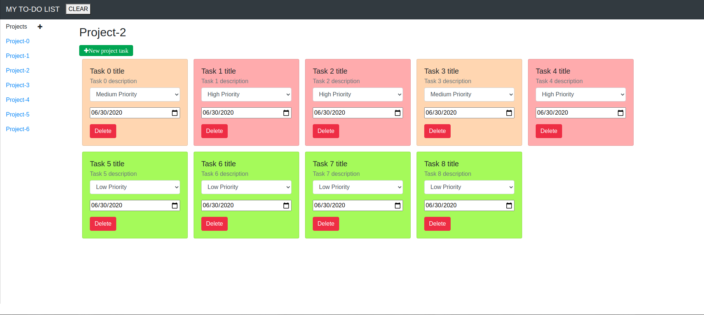

# Javascript Weather App

This project is about building a web application to show a weather forecast using weather API from external services like https://openweathermap.org/ and https://giphy.com/, you should be able to search for a specific location and toggle displaying the data in Fahrenheit or Celsius.



## Built With

- HTML
- Javascript
- Webpack
- Webpack modules

## Live Demo

[Live Demo Link](http://weather-app.cuscosolutions.com/)


## Getting Started

**Want to check the code and make some changes please .**

Do you want to clone this project please use this command on you terminal

```
git clone git@github.com:rubenpazch/js-weather-app.git
```

webpack is used to compile JavaScript modules. Once installed, you can interface with webpack either from its CLI or API. If you're still new to webpack, please read through the core concepts and this comparison to learn why you might use it over the other tools that are out in the community.

Core concepts : [Webpack](https://webpack.js.org/concepts/)


### Prerequisites

- Webpack 
- NPM 

### Setup

Install NPM

Check that you have node and npm installed

To check if you have Node.js installed, run this command in your terminal:


```
node -v
```

To confirm that you have npm installed you can run this command in your terminal:


```
npm -v
```


### Install

install npm and webpack


```
sudo apt update
sudo apt install npm
```


:Show
Local Installation Webpack

To install the latest release or a specific version, run one of the following commands:

```
npm install --save-dev webpack
npm install --save-dev webpack-cli
```

Global Installation Webpack

The following NPM installation will make webpack available globally:

```
npm install --global webpack
```
Now you can make changes on src files to change the behavior of the application

finally if you want to compile the code run this command

```
npm run build
```

## Authors


👤 **Ruben Paz Chuspe**

- Github: [@rubenpazch](https://github.com/rubenpazch)
- Linkedin: [rubenpch](https://www.linkedin.com/in/rubenpch/)
- Twitter: [chuspepaz](https://twitter.com/ChuspePaz)


## 🤝 Contributing

Contributions, issues and feature requests are welcome!

Feel free to check the [issues page](issues/).

## Show your support

Give a ⭐️ if you like this project!

## Acknowledgments

- We thank microverse inc. for this learning opportunity.
